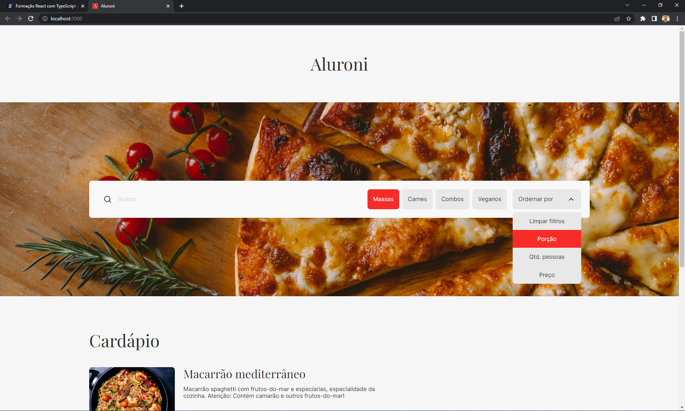

# Aluroni

O Aluroni é o projeto do curso "React: conhecendo a biblioteca React Router" da Alura.

Neste curso você aprende:

* Como refatorar um projeto utilizando ESLint;
* Como desenvolver um código escalável, priorizando um código limpo e fácil de entender;
* A utilizar o pacote react-router-dom de forma simples e prática, aprendendo todos os conceitos principais da biblioteca;
* Como a biblioteca se integra com o navegador e utiliza de coisas nativas para mudar as rotas e compartilhar estados;
* Como criar telas navegando entre elas de diversas formas diferentes e reaproveite componentes eles elas;
* Sobre nested routes e como criá-las para reaproveitar código e resolver problemas;

Link do curso: [React: conhecendo a biblioteca React Router](https://www.alura.com.br/curso-online-react-biblioteca-react-router)

## Guia

No diretório do projeto, você pode rodar:

### `npm start`

Roda o app em modo de desenvolvimento.\
Abra [http://localhost:3000](http://localhost:3000) para ver em seu navegador.

A página irá recarregar se você fizer edições.\
Você também pode ver erros de lint no console.
